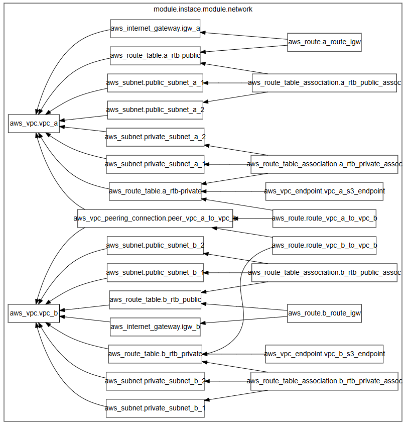

## Projeto de Arquitetura - Utilizando Peering 


A ideia desse projeto é testar uma atividade feita em aula de Network. 

A parte provavelmente mais dificil foi "traduzir" a atividade em um desenho de arquitetura. 

A parte boa é que o ChatGPT falou que está bom, então vamos seguir com ela até entender algo mais simples.

Desculpa se o README parecer um diário, pois será mesmo. 


Vamos ao que importa! 

A ideia ainda é meio simploria teremos duas VPCs e elas vão conversar uma com a outra :)

Mas colocando um pouco de complexidade, teremos uma comunicação entre redes diferentes sendo auxiliada por duas Routers Tables. Confia, vai dar bom. 

# TO DOs 
- Verificar a questão de conexão entre a máquina Pública e a Máquina Privada A -> Mauqina Privada B 
- 

## A divisão de Pastas - Não menos importante 

Estou testando meios de configuração de pastas, mas ainda não cheguei em uma definitiva. 
Ao meu ver os modulos ficam mais organizados em pastas <i>services<i/>


Veja como faço minha distribuição: 

```shell
.
├── images
│   ├── diagram_network.png
│   └── image.png
├── main.tf
├── README.md
├── services
│   ├── instance
│   │   ├── main.tf
│   │   └── variables.tf
│   └── network
│       ├── main.tf
│       ├── output.tf
│       ├── subnets.tf
│       └── variables.tf
└── variables.tf

4 directories, 11 files
```

## Diagrama do Terraform 

Acredito que essa 




## Coisas Importantes que foram aprendidas 

### LOOPING!!! - Faremos uma parte 2 depois rs 

Sério, isso aqui é tão bom quanto - ta ligado, né?

Agora vamos deixar explicito algumas coisas 

DEU TUDO ERRADO AAAAAAAA 
Mas acontece que realmente a complexidade saiu de 1 para escala de 20 (pensando em números que nem fazem sentido)
Então por enquanto vamos deixar os loopings de lado e começar a terminar o projeto 


```hcl
# variables.tf

variable "vpc_cidr_blocks_list" {
  type = map(object({    # Informando qual a composicao do objeto
    prefix_vpc = string
    cidr_block = string
  }))
  ## O que faz parte do objeto 
  default = {
    "vpc_a" = {
      prefix_vpc = "A"
      cidr_block = "10.0.0.0/16"
    }
    "vpc_b" = {
      prefix_vpc = "B"
      cidr_block = "10.1.0.0/16"
    }
  }
}

``` 

```hcl

resource "aws_vpc" "VPCs" {
  for_each = var.vpc_cidr_blocks_list
  
  cidr_block = each.value.cidr_block

  tags = {
    Name = "VPC-${each.value.prefix_vpc}"
  }
}

## IGW -
resource "aws_internet_gateway" "igw" {
  
  for_each = aws_vpc.VPCs
  vpc_id = each.value.id
  tags = {
    Name = "IGW-${each.value.tags["Name"]}"
  }
}

```

## Alguns passos depois... 

Chegamos em um ponto em que é possível se ver nessa arquitetura de rede, temos algo simples, porém funcional. 

Utilizando-se da melhor forma de looping que o terraform e o chatgpt podem oferecer. 

Agora o grande passo é: 

## Como vou criar a mesma estrutura de Rede com apenas mudanças de parametros? 

Essa é a grande questão para quem está começando e criando uma arquitetura relativamente (pequena) grande. Problema esse agora que pode ser feito da mesma forma que foi resolvidos os outros. 

Aqui só não podemos nos acostumar com lixeira, por favor. Queremos um código limpo e funcional. 


Imagem do pequeno sucesso. 


## Como referenciar?


## 