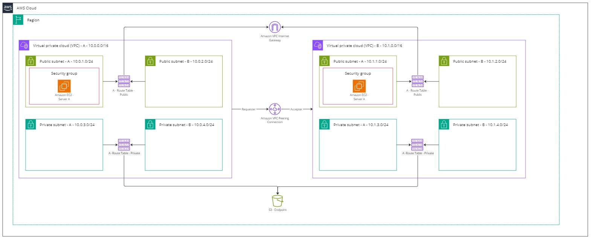

## Projeto de Arquitetura - Utilizando Peering 


A ideia desse projeto é testar uma atividade feita em aula de Network. 

A parte provavelmente mais dificil foi "traduzir" a atividade em um desenho de arquitetura. 

A parte boa é que o ChatGPT falou que está bom, então vamos seguir com ela até entender algo mais simples.

Desculpa se o README parecer um diário, pois será mesmo. 


Vamos ao que importa! 

A ideia ainda é meio simploria teremos duas VPCs e elas vão conversar uma com a outra :)

Mas colocando um pouco de complexidade, teremos uma comunicação entre redes diferentes sendo auxiliada por duas Routers Tables. Confia, vai dar bom. 


## A divisão de Pastas - Não menos importante 

Estou testando meios de configuração de pastas, mas ainda não cheguei em uma definitiva. 
Ao meu ver os modulos ficam mais organizados em pastas <i>services<i/>


Veja como faço minha distribuição: 

```shell
.
├── images
│   └── image.png
├── main.tf
├── README.md
└── services
    ├── instance
    │   └── main.tf
    └── network
        ├── main.tf
        └── output.tf

4 directories, 6 files
```

Ainda estou entendendo como funciona a parte de modularização, então tempo ao tempo. 

To-Do! 

- Entender melhor como organizar o código no output.tf (preciso dar sentido pra isso depois, por isso o to-do)




## Diagrama do Terraform 

Veja que lindezas o Terraform pode extrair. 


Vou inserir depois com o terraform graph mesmo achando feio pra cacete


## Coisas Importantes que foram aprendidas 

### LOOPING!!!

Sério, isso aqui é tão bom quanto - ta ligado, né? Mas 

```hcl
variable "subnets" {
  type = map(string)
  default = {
    "subnet1" = "10.0.1.0/24"
    "subnet2" = "10.0.2.0/24"
    "subnet3" = "10.0.3.0/24"
  }
}

resource "aws_subnet" "my_subnet" {
  for_each = var.subnets

  vpc_id     = aws_vpc.main.id
  cidr_block = each.value

  tags = {
    Name = each.key
  }
}

``` 